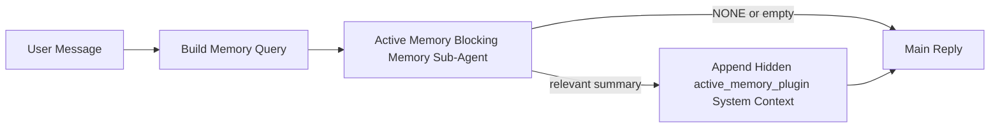

# Active Memory

Active memory is an optional plugin-owned blocking memory sub-agent that runs
before the main reply for eligible conversational sessions.

It exists because most memory systems are capable but reactive. They rely on
the main agent to decide when to search memory, or on the user to say things
like "remember this" or "search memory." By then, the moment where memory would
have made the reply feel natural has already passed.

Active memory gives the system one bounded chance to surface relevant memory
before the main reply is generated.

## Paste This Into Your Agent

Paste this into your agent if you want it to enable Active Memory with a
self-contained, safe-default setup:

```json5
{
  plugins: {
    entries: {
      "active-memory": {
        enabled: true,
        config: {
          enabled: true,
          agents: ["main"],
          allowedChatTypes: ["direct"],
          modelFallback: "google/gemini-3-flash",
          queryMode: "recent",
          promptStyle: "balanced",
          timeoutMs: 15000,
          maxSummaryChars: 220,
          persistTranscripts: false,
          logging: true,
        },
      },
    },
  },
}
```

This turns the plugin on for the `main` agent, keeps it limited to direct-message
style sessions by default, lets it inherit the current session model first, and
uses the configured fallback model only if no explicit or inherited model is
available.

After that, restart the gateway:

```bash
openclaw gateway
```

To inspect it live in a conversation:

```text
/verbose on
/trace on
```

## Turn active memory on

The safest setup is:

1. enable the plugin
2. target one conversational agent
3. keep logging on only while tuning

Start with this in `openclaw.json`:

```json5
{
  plugins: {
    entries: {
      "active-memory": {
        enabled: true,
        config: {
          agents: ["main"],
          allowedChatTypes: ["direct"],
          modelFallback: "google/gemini-3-flash",
          queryMode: "recent",
          promptStyle: "balanced",
          timeoutMs: 15000,
          maxSummaryChars: 220,
          persistTranscripts: false,
          logging: true,
        },
      },
    },
  },
}
```

Then restart the gateway:

```bash
openclaw gateway
```

What this means:

- `plugins.entries.active-memory.enabled: true` turns the plugin on
- `config.agents: ["main"]` opts only the `main` agent into active memory
- `config.allowedChatTypes: ["direct"]` keeps active memory on for direct-message style sessions only by default
- if `config.model` is unset, active memory inherits the current session model first
- `config.modelFallback` optionally provides your own fallback provider/model for recall
- `config.promptStyle: "balanced"` uses the default general-purpose prompt style for `recent` mode
- active memory still runs only on eligible interactive persistent chat sessions

## How to see it

Active memory injects hidden system context for the model. It does not expose
raw `<active_memory_plugin>...</active_memory_plugin>` tags to the client.

## Session toggle

Use the plugin command when you want to pause or resume active memory for the
current chat session without editing config:

```text
/active-memory status
/active-memory off
/active-memory on
```

This is session-scoped. It does not change
`plugins.entries.active-memory.enabled`, agent targeting, or other global
configuration.

If you want the command to write config and pause or resume active memory for
all sessions, use the explicit global form:

```text
/active-memory status --global
/active-memory off --global
/active-memory on --global
```

The global form writes `plugins.entries.active-memory.config.enabled`. It leaves
`plugins.entries.active-memory.enabled` on so the command remains available to
turn active memory back on later.

If you want to see what active memory is doing in a live session, turn on the
session toggles that match the output you want:

```text
/verbose on
/trace on
```

With those enabled, OpenClaw can show:

- an active memory status line such as `Active Memory: ok 842ms recent 34 chars` when `/verbose on`
- a readable debug summary such as `Active Memory Debug: Lemon pepper wings with blue cheese.` when `/trace on`

Those lines are derived from the same active memory pass that feeds the hidden
system context, but they are formatted for humans instead of exposing raw prompt
markup. They are sent as a follow-up diagnostic message after the normal
assistant reply so channel clients like Telegram do not flash a separate
pre-reply diagnostic bubble.

By default, the blocking memory sub-agent transcript is temporary and deleted
after the run completes.

Example flow:

```text
/verbose on
/trace on
what wings should i order?
```

Expected visible reply shape:

```text
...normal assistant reply...

🧩 Active Memory: ok 842ms recent 34 chars
🔎 Active Memory Debug: Lemon pepper wings with blue cheese.
```

## When it runs

Active memory uses two gates:

1. **Config opt-in**
   The plugin must be enabled, and the current agent id must appear in
   `plugins.entries.active-memory.config.agents`.
2. **Strict runtime eligibility**
   Even when enabled and targeted, active memory only runs for eligible
   interactive persistent chat sessions.

The actual rule is:

```text
plugin enabled
+
agent id targeted
+
allowed chat type
+
eligible interactive persistent chat session
=
active memory runs
```

If any of those fail, active memory does not run.

## Session types

`config.allowedChatTypes` controls which kinds of conversations may run Active
Memory at all.

The default is:

```json5
allowedChatTypes: ["direct"]
```

That means Active Memory runs by default in direct-message style sessions, but
not in group or channel sessions unless you opt them in explicitly.

Examples:

```json5
allowedChatTypes: ["direct"]
```

```json5
allowedChatTypes: ["direct", "group"]
```

```json5
allowedChatTypes: ["direct", "group", "channel"]
```

## Where it runs

Active memory is a conversational enrichment feature, not a platform-wide
inference feature.

| Surface                                                             | Runs active memory?                                     |
| ------------------------------------------------------------------- | ------------------------------------------------------- |
| Control UI / web chat persistent sessions                           | Yes, if the plugin is enabled and the agent is targeted |
| Other interactive channel sessions on the same persistent chat path | Yes, if the plugin is enabled and the agent is targeted |
| Headless one-shot runs                                              | No                                                      |
| Heartbeat/background runs                                           | No                                                      |
| Generic internal `agent-command` paths                              | No                                                      |
| Sub-agent/internal helper execution                                 | No                                                      |

## Why use it

Use active memory when:

- the session is persistent and user-facing
- the agent has meaningful long-term memory to search
- continuity and personalization matter more than raw prompt determinism

It works especially well for:

- stable preferences
- recurring habits
- long-term user context that should surface naturally

It is a poor fit for:

- automation
- internal workers
- one-shot API tasks
- places where hidden personalization would be surprising

## How it works

The runtime shape is:



The blocking memory sub-agent can use only:

- `memory_search`
- `memory_get`

If the connection is weak, it should return `NONE`.

## Query modes

`config.queryMode` controls how much conversation the blocking memory sub-agent sees.

## Prompt styles

`config.promptStyle` controls how eager or strict the blocking memory sub-agent is
when deciding whether to return memory.